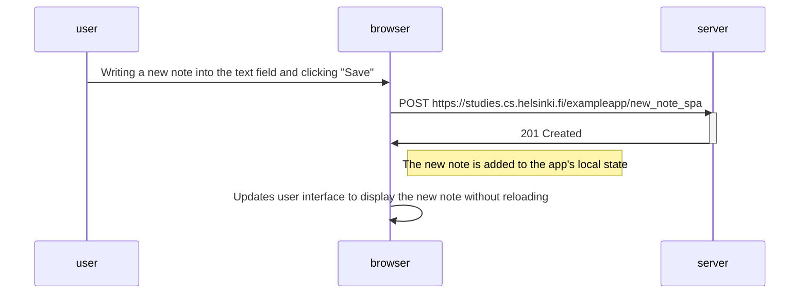

```mermaid
sequenceDiagram
    participant user
    participant browser
    participant server

    user->>browser: Writing a new note into the text field and clicking "Save"

    browser->>server: POST https://studies.cs.helsinki.fi/exampleapp/new_note_spa
    activate server
    server->>browser: 201 Created
    deactivate server

    Note right of browser: The new note is added to the app's local state

    browser->>browser: Updates user interface to display the new note without reloading
```
